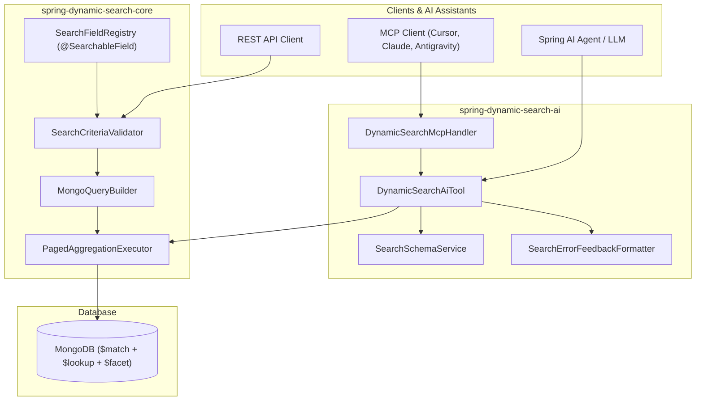

# Spring Dynamic Search

[](https://central.sonatype.com/artifact/io.github.bereczkitamas/spring-dynamic-search)
[](https://opensource.org/licenses/Apache-2.0)
[](https://openjdk.org/)
[](https://spring.io/projects/spring-boot)

A high-performance, type-safe dynamic querying, filtering, and aggregation library for **Spring Data MongoDB** and **AI Agents**.

---

## 📦 Modules

| Module | Description | When to Use |
|---|---|---|
| [`spring-dynamic-search-core`](./spring-dynamic-search-core) | Core MongoDB dynamic querying engine, criteria translation, foreign joins, stage pushdown, and `@SearchableField` annotations. | Standard CRUD microservices, REST APIs, and database filtering without AI dependencies. |
| [`spring-dynamic-search-ai`](./spring-dynamic-search-ai) | AI Agent integration, Spring AI `@Tool` callbacks, Model Context Protocol (MCP) server endpoints, schema introspection, and LLM query auto-repair. | Natural language search, chatbot assistants, autonomous coding agents, and hybrid RAG. |

---

## 🌟 Architecture



---

## 🚀 Quick Start

### 1. Core Usage (MongoDB Search Engine)

```xml
<dependency>
    <groupId>io.github.bereczkitamas</groupId>
    <artifactId>spring-dynamic-search-core</artifactId>
    <version>0.0.1</version>
</dependency>
```

```java
@SearchableField(description = "Customer username", operations = {SearchOperation.EQUALS, SearchOperation.LIKE})
private String username;

@JoinedField(collection = "countries", localField = "country_id", as = "country", documentField = "country.name")
private String countryName;
```

---

### 2. AI Agent & MCP Usage (Natural Language Queries & Tools)

```xml
<dependency>
    <groupId>io.github.bereczkitamas</groupId>
    <artifactId>spring-dynamic-search-ai</artifactId>
    <version>0.0.1</version>
</dependency>
```

```java
@Bean
public DynamicSearchAiTool<CustomerDto, ?> customerSearchAiTool(PagedAggregationExecutor executor) {
  SearchFieldRegistry registry = SearchFieldRegistry.from(CustomerDto.class);
  return DynamicSearchAiTool.of(executor, registry, CustomerDto.class);
}
```

---

## 📚 Documentation & Guides

- [**Core Engine Guide & Query Reference**](./spring-dynamic-search-core/README.md)
- [**AI Agent & MCP Integration Reference**](./spring-dynamic-search-ai/README.md)
- [**Architecture & Deep-Dive Guide**](./docs/AI_AGENT_INTEGRATION_GUIDE.md)

---

## 📄 License
This project is licensed under the [Apache License, Version 2.0](https://www.apache.org/licenses/LICENSE-2.0).
