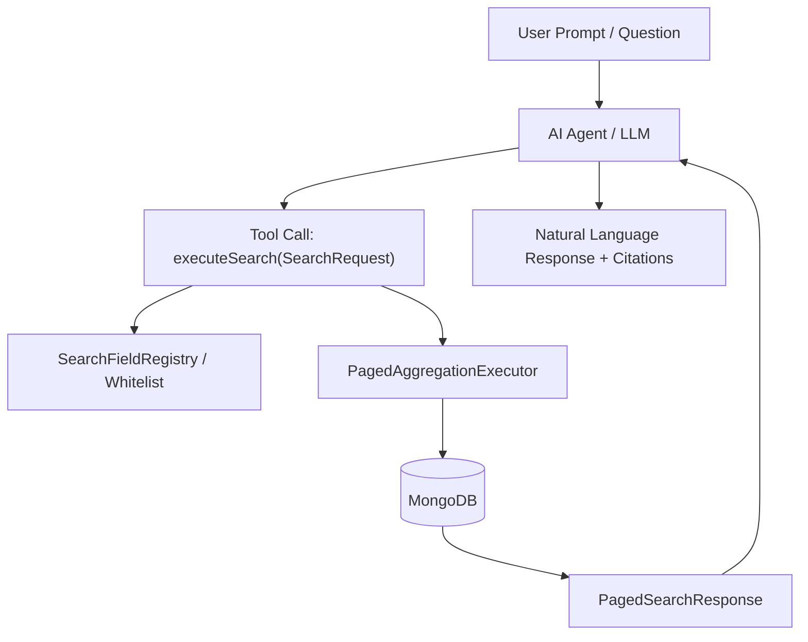

# AI Agent & LLM Tool Integration Architecture

This document outlines the architectural blueprint for integrating `spring-dynamic-search` with AI Agents, LLM Function Calling, Model Context Protocol (MCP), and Spring AI.

---

## 1. Why `spring-dynamic-search` is Ideal for AI Agents

LLMs (Large Language Models) interacting with production databases face three fundamental challenges:
1. **Security & Injection Risks**: Generating raw database queries (e.g. raw MongoDB aggregation pipelines or SQL) opens significant surface areas for prompt injection and unauthorized field access.
2. **Schema Drift & Semantic Hallucinations**: LLMs frequently hallucinate field names or use incompatible query operators.
3. **Execution Complexity**: Constructing correct `$lookup` joins, pre/post-join filter stage placement, date/time ISO conversions, and memory-safe pagination is error-prone for generative models.

`spring-dynamic-search` addresses all three:
- **Strict Whitelisting**: Every query is strictly validated against a typed `SearchFieldRegistry`.
- **Deterministic Schema**: `SearchRequest` provides a typed, concise JSON contract optimized for LLM tool calling.
- **Autonomous Optimization**: The library handles all query translation, type conversions, join lookups, and stage pushdown automatically.

---

## 2. Core Use Cases



### 1. Natural Language Text-to-Database Search (NLQ)
- **Goal**: Enable non-technical users to query complex databases in natural language.
- **Example**:
  - *User*: *"Find active users in Germany who registered in 2025 and have the 'ADMIN' tag, sorted by age."*
  - *Agent*: Constructs `SearchRequest`:
    ```json
    {
      "criteria": [
        { "field": "status", "operation": "EQUALS", "value": "ACTIVE" },
        { "field": "countryName", "operation": "EQUALS", "value": "Germany" },
        { "field": "createdAt", "operation": "BETWEEN", "value": ["2025-01-01T00:00:00Z", "2025-12-31T23:59:59Z"] },
        { "field": "tags", "operation": "IN", "value": ["ADMIN"] }
      ],
      "operator": "AND"
    }
    ```

### 2. Model Context Protocol (MCP) Server for Autonomous Coding & Analytics Agents
- Expose `spring-dynamic-search` as an **MCP Server** tool:
  - `list_searchable_fields`: Returns fields, types, and allowed operations.
  - `execute_search`: Executes `SearchRequest` with pagination.
- Allows external AI assistants (Cursor, Claude Desktop, Antigravity, custom agents) to inspect and query enterprise data securely.

### 3. Spring AI `@Tool` Component
- Provide a drop-in Spring AI component:
  ```java
  @Component
  public class DynamicSearchTools {

    private final PagedAggregationExecutor executor;
    private final SearchFieldRegistry registry;

    @Tool(description = "Search entities using structured criteria, joins, and pagination")
    public PagedSearchResponse<UserDto> searchUsers(SearchRequest request, Pageable pageable) {
      return executor.executeSearch(request, registry, pageable, User.class, UserPagedResult.class);
    }
  }
  ```

### 4. Structured Hybrid RAG (Retrieval-Augmented Generation)
- Enhance vector search by applying structured pre-filtering (tenant ID, date ranges, tags via `CONTAINS_ALL`, existence flags via `EXISTS`) before vector nearest-neighbor search or synthesis.

### 5. Automated Query Self-Correction
- If an agent generates an invalid field or operation, the library throws `InvalidSearchFieldException` or `InvalidSearchOperationException`. The agent reads the exact validation error, inspects allowed operations, and self-corrects the query without human intervention.

---

## 3. Planned Deliverables in Backlog

1. **`spring-dynamic-search-ai` / `spring-ai-starter` Module**:
   - Auto-configured Spring AI `@Tool` definitions.
   - Dynamic tool definition generator from any `SearchFieldRegistry`.
2. **MCP Server Integration (`spring-dynamic-search-mcp`)**:
   - Fast MCP tool server exposing search endpoints.
3. **OpenAPI / JSON Schema Export**:
   - `SearchSchemaService` to provide live schema definitions directly into LLM system prompts.
