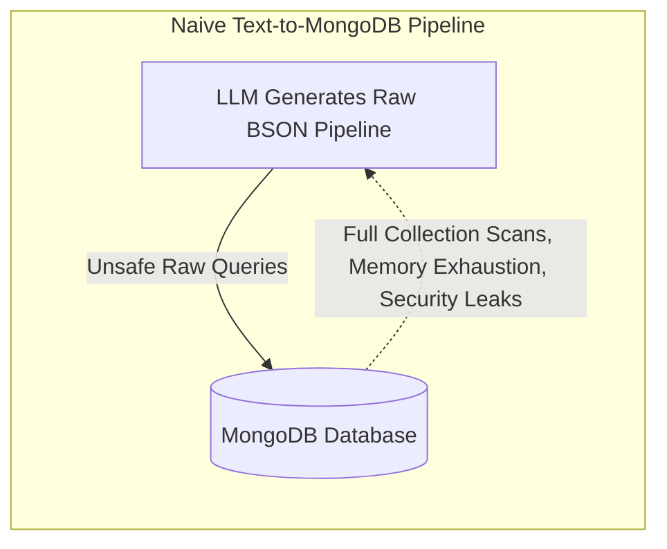
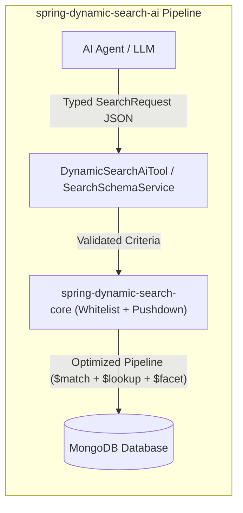
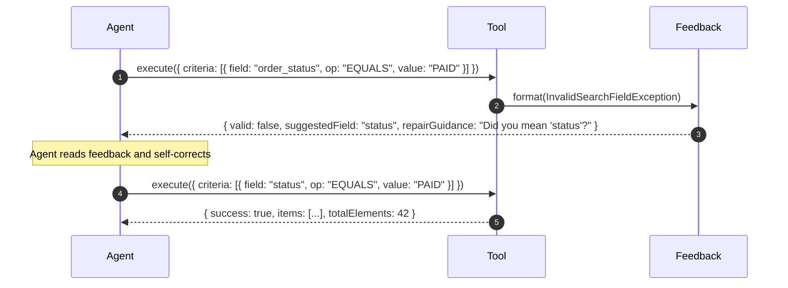

# Complete AI Agent & Model Context Protocol (MCP) Integration Guide

This guide provides an end-to-end specification and integration tutorial for building AI Agents, Natural Language Query (NLQ) engines, and Model Context Protocol (MCP) servers using `spring-dynamic-search-ai`.

---

## Table of Contents
1. [The Challenge: LLM-to-Database Bottlenecks](#1-the-challenge-llm-to-database-bottlenecks)
2. [How `spring-dynamic-search-ai` Solves It](#2-how-spring-dynamic-search-ai-solves-it)
3. [Component Architecture & Class Model](#3-component-architecture--class-model)
4. [Step-by-Step Integration Guide](#4-step-by-step-integration-guide)
   - [Step 1: Define Domain Models with AI Metadata](#step-1-define-domain-models-with-ai-metadata)
   - [Step 2: Configure the Spring AI Tool](#step-2-configure-the-spring-ai-tool)
   - [Step 3: Build a Natural Language Search Service](#step-3-build-a-natural-language-search-service)
   - [Step 4: Expose as an MCP Tool for IDEs and Assistants](#step-4-expose-as-an-mcp-tool-for-ides-and-assistants)
5. [Autonomous Self-Correction & Feedback Loop](#5-autonomous-self-correction--feedback-loop)
6. [Hybrid RAG (Retrieval-Augmented Generation) Pattern](#6-hybrid-rag-retrieval-augmented-generation-pattern)
7. [Security & Whitelisting Architecture](#7-security--whitelisting-architecture)

---

## 1. The Challenge: LLM-to-Database Bottlenecks

Directly connecting Large Language Models to production databases via text-to-SQL or text-to-Mongo code generation introduces critical failure points:



1. **Security & Prompt Injection Risks**: If an LLM generates raw queries, malicious prompts can access private collections, bypass tenant separation, or perform unauthorized field lookups.
2. **Schema Drift & Semantic Hallucinations**: Models frequently hallucinate field names (`user_created_date` vs `createdAt`) or use invalid operators (e.g. attempting regex on integers or date ranges on booleans).
3. **Complex Aggregation Optimization**: Constructing `$lookup` joins, unwinds (`$unwind`), indexed stage pushdown, and facet pagination is extremely difficult for generative models to balance efficiently.

---

## 2. How `spring-dynamic-search-ai` Solves It

`spring-dynamic-search-ai` acts as a **safe, typed mediation layer**:



- **Strict Whitelist**: Queries can only filter on explicitly configured fields and allowed operations.
- **Deterministic Tool Schema**: LLMs generate standard `SearchRequest` JSON matching an OpenAPI / JSON Schema.
- **Autonomous Query Execution**: The library handles type conversions (e.g. ISO 8601 strings to `Instant`/`LocalDate`), indexed stage pushdown, foreign joins, and pagination.

---

## 3. Component Architecture & Class Model

| Class | Role | Responsibility |
|---|---|---|
| [`SearchSchemaService`](../spring-dynamic-search-ai/src/main/java/com/bereczkitamas/libs/spring/dynamicsearch/ai/SearchSchemaService.java) | Introspection | Inspects `@SearchableField` / registries and generates JSON Schemas, OpenAPI models, and token-optimized system prompts. |
| [`DynamicSearchAiTool`](../spring-dynamic-search-ai/src/main/java/com/bereczkitamas/libs/spring/dynamicsearch/ai/DynamicSearchAiTool.java) | Execution | Executes `SearchToolRequest` with pagination/sorting and returns structured items or diagnostic error guidance. |
| [`SearchErrorFeedbackFormatter`](../spring-dynamic-search-ai/src/main/java/com/bereczkitamas/libs/spring/dynamicsearch/ai/SearchErrorFeedbackFormatter.java) | Auto-Repair | Calculates Levenshtein string distance to suggest closest field names and valid operations when an agent makes a mistake. |
| [`DynamicSearchMcpHandler`](../spring-dynamic-search-ai/src/main/java/com/bereczkitamas/libs/spring/dynamicsearch/ai/mcp/DynamicSearchMcpHandler.java) | MCP Protocol | Exposes Anthropic Model Context Protocol tools (`list_search_fields`, `execute_dynamic_search`). |

---

## 4. Step-by-Step Integration Guide

### Step 1: Define Domain Models with AI Metadata

Use `@SearchableField` and `@JoinedField` to enrich fields with human and AI readable descriptions and example values:

```java
package com.example.domain;

import com.bereczkitamas.libs.spring.dynamicsearch.annotation.JoinedField;
import com.bereczkitamas.libs.spring.dynamicsearch.annotation.SearchableField;
import com.bereczkitamas.libs.spring.dynamicsearch.data.SearchOperation;
import java.time.Instant;
import lombok.Data;

@Data
public class OrderDto {

  @SearchableField(
      description = "Unique order tracking code",
      examples = {"ORD-98231", "ORD-11029"},
      operations = {SearchOperation.EQUALS, SearchOperation.IN}
  )
  private String orderNumber;

  @SearchableField(
      description = "Order fulfillment status: PENDING, PAID, SHIPPED, DELIVERED, CANCELLED",
      examples = {"PAID", "DELIVERED"},
      operations = {SearchOperation.EQUALS, SearchOperation.IN, SearchOperation.NOT_EQUALS}
  )
  private String status;

  @SearchableField(
      description = "Total order amount in USD",
      examples = {"49.99", "1250.00"},
      operations = {SearchOperation.GREATER_THAN, SearchOperation.LESS_THAN, SearchOperation.BETWEEN}
  )
  private double totalAmount;

  @SearchableField(description = "Timestamp when the order was placed")
  private Instant createdAt;

  @JoinedField(
      collection = "customers",
      localField = "customer_id",
      foreignField = "_id",
      as = "customer",
      documentField = "customer.email",
      description = "Email of the purchasing customer",
      examples = {"jane@company.com"},
      operations = {SearchOperation.EQUALS, SearchOperation.LIKE}
  )
  private String customerEmail;
}
```

---

### Step 2: Configure the Spring AI Tool

```java
package com.example.config;

import com.bereczkitamas.libs.spring.dynamicsearch.ai.DynamicSearchAiTool;
import com.bereczkitamas.libs.spring.dynamicsearch.data.PagedAggregationExecutor;
import com.bereczkitamas.libs.spring.dynamicsearch.data.SearchFieldRegistry;
import com.example.domain.OrderDto;
import org.springframework.context.annotation.Bean;
import org.springframework.context.annotation.Configuration;

@Configuration
public class SearchAiConfig {

  @Bean
  public DynamicSearchAiTool<OrderDto, ?> orderSearchAiTool(PagedAggregationExecutor executor) {
    SearchFieldRegistry registry = SearchFieldRegistry.from(OrderDto.class);
    return DynamicSearchAiTool.of(executor, registry, OrderDto.class);
  }
}
```

---

### Step 3: Build a Natural Language Search Service

```java
package com.example.service;

import com.bereczkitamas.libs.spring.dynamicsearch.ai.DynamicSearchAiTool;
import com.example.domain.OrderDto;
import org.springframework.ai.chat.client.ChatClient;
import org.springframework.stereotype.Service;

@Service
public class OrderAssistantService {

  private final ChatClient chatClient;
  private final DynamicSearchAiTool<OrderDto, ?> orderTool;

  public OrderAssistantService(
      ChatClient.Builder builder,
      DynamicSearchAiTool<OrderDto, ?> orderTool) {
    this.chatClient = builder.build();
    this.orderTool = orderTool;
  }

  public String searchOrders(String naturalLanguageQuery) {
    return chatClient.prompt()
        .system(orderTool.getSystemPrompt()) // Automatically provides prompt instructions & schema
        .user(naturalLanguageQuery)
        .tools(orderTool::execute)
        .call()
        .content();
  }
}
```

---

### Step 4: Expose as an MCP Tool for IDEs and Assistants

You can expose the search capabilities over the Model Context Protocol (MCP) for Cursor, Claude Desktop, Antigravity, or any MCP client:

```java
package com.example.mcp;

import com.bereczkitamas.libs.spring.dynamicsearch.ai.DynamicSearchAiTool;
import com.bereczkitamas.libs.spring.dynamicsearch.ai.mcp.DynamicSearchMcpHandler;
import com.example.domain.OrderDto;
import org.springframework.context.annotation.Bean;
import org.springframework.context.annotation.Configuration;

@Configuration
public class McpToolConfig {

  @Bean
  public DynamicSearchMcpHandler<OrderDto, ?> orderMcpHandler(
      DynamicSearchAiTool<OrderDto, ?> orderTool) {
    return new DynamicSearchMcpHandler<>(orderTool);
  }
}
```

---

## 5. Autonomous Self-Correction & Feedback Loop

When an AI Agent sends an invalid query (for instance, guessing `order_status` instead of `status`), `SearchErrorFeedbackFormatter` diagnoses the failure and suggests the closest valid field:



---

## 6. Hybrid RAG (Retrieval-Augmented Generation) Pattern

In modern generative systems, pure vector similarity search often lacks exact metadata filtering (e.g. tenant restrictions, date bounds, or status filters).

`spring-dynamic-search-ai` enables **Hybrid Structured + Vector RAG**:
1. The AI Agent extracts structured metadata filters (e.g., `tenantId EQUALS "acme"`, `createdAt GREATER_THAN "2025-01-01"`, `status IN ["APPROVED"]`).
2. `DynamicSearchAiTool` fetches the exact matching candidate document IDs.
3. Vector similarity search is constrained to those candidate IDs, guaranteeing 100% security, zero hallucinated metadata, and blazing-fast vector index lookups.

---

## 7. Security & Whitelisting Architecture

All queries processed by `spring-dynamic-search-core` and `spring-dynamic-search-ai` must pass the whitelist validation:

1. **Whitelisted Field Verification**: Only fields declared in the `SearchFieldRegistry` (or `@SearchableField`/`@JoinedField`) are accepted.
2. **Operation Verification**: Each field can only be queried using operators configured in `allowedOperations`.
3. **Type-Safe Value Coercion**: Values are strictly parsed into their target Java types using Jackson before hitting MongoDB queries.
4. **Pre-Join Stage Pushdown**: Queries on local fields are placed at the very front of the aggregation pipeline before foreign lookups, preventing memory exhaustion attacks.
