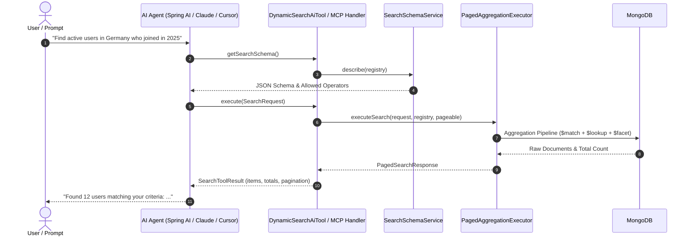

# Spring Dynamic Search AI (`spring-dynamic-search-ai`)

[](https://central.sonatype.com/artifact/io.github.bereczkitamas/spring-dynamic-search-ai)
[](https://opensource.org/licenses/Apache-2.0)
[](https://openjdk.org/)

`spring-dynamic-search-ai` is an enterprise-grade AI Agent, LLM Function Calling, and **Model Context Protocol (MCP)** integration layer for Spring Data MongoDB.

It transforms [`spring-dynamic-search-core`](../spring-dynamic-search-core) into a safe, deterministic, and autonomous database interface for Large Language Models (LLMs)—including OpenAI GPT-4o, Anthropic Claude 3.7 / 3.5, Google Gemini, and open-source models via Spring AI.

---

## 🌟 Why Use `spring-dynamic-search-ai`?

| Challenge with Raw LLM-to-Database | How `spring-dynamic-search-ai` Solves It |
|---|---|
| **Security & Injection Risks**: LLMs generating raw MongoDB queries / pipelines can leak private data, execute unindexed full-collection scans, or suffer from prompt injections. | **Strict Whitelisting**: Every search query is strictly validated against a typed `SearchFieldRegistry` or `@SearchableField` annotation. |
| **Hallucinated Fields & Types**: LLMs often guess invalid field names or incompatible operators (e.g. `LIKE` on an Integer). | **Schema Introspection**: Live JSON Schemas and token-optimized system prompts communicate exact fields, types, descriptions, and allowed operations. |
| **Complex Aggregations & Joins**: Foreign joins (`$lookup`), unwinds (`$unwind`), indexed stage pushdown, and facet pagination are error-prone for LLMs. | **Autonomous Query Translation**: The underlying engine handles all aggregation pipelines, indexed stage placement, and memory-safe pagination. |
| **Agent Tool Execution Failures**: When an LLM generates a slightly incorrect field name, the entire conversation often crashes. | **LLM Error Diagnostics & Auto-Repair**: Calculates fuzzy similarity (Levenshtein distance) and returns actionable repair guidance directly to the model. |

---

## 🏗️ Architecture & Interaction Flow



---

## 📦 Maven Dependency

Add the AI module to your `pom.xml`:

```xml
<dependency>
    <groupId>io.github.bereczkitamas</groupId>
    <artifactId>spring-dynamic-search-ai</artifactId>
    <version>0.0.1</version>
</dependency>
```

---

## 🚀 Quick Start Guide

### Step 1: Annotate Your Entity / DTO

Annotate your domain model with `@SearchableField` and `@JoinedField`. Provide descriptions and example values to guide the AI model:

```java
import com.bereczkitamas.libs.spring.dynamicsearch.annotation.JoinedField;
import com.bereczkitamas.libs.spring.dynamicsearch.annotation.SearchableField;
import com.bereczkitamas.libs.spring.dynamicsearch.data.SearchOperation;
import java.time.LocalDate;

public class CustomerDto {

  @SearchableField(
      description = "Unique customer username / handle",
      examples = {"alice_w", "bob99"},
      operations = {SearchOperation.EQUALS, SearchOperation.LIKE, SearchOperation.IN}
  )
  private String username;

  @SearchableField(
      description = "Customer age in full years",
      examples = {"25", "40"}
  )
  private int age;

  @SearchableField(description = "Account registration date")
  private LocalDate registeredAt;

  @JoinedField(
      collection = "countries",
      localField = "country_id",
      foreignField = "_id",
      as = "country",
      documentField = "country.name",
      description = "Country of residence",
      examples = {"Germany", "United States", "Hungary"},
      operations = {SearchOperation.EQUALS, SearchOperation.IN}
  )
  private String countryName;
}
```

---

### Step 2: Initialize the AI Search Tool

Create a `DynamicSearchAiTool` instance using the declarative factory:

```java
import com.bereczkitamas.libs.spring.dynamicsearch.ai.DynamicSearchAiTool;
import com.bereczkitamas.libs.spring.dynamicsearch.data.PagedAggregationExecutor;
import com.bereczkitamas.libs.spring.dynamicsearch.data.SearchFieldRegistry;
import org.springframework.context.annotation.Bean;
import org.springframework.context.annotation.Configuration;

@Configuration
public class AiSearchConfiguration {

  @Bean
  public DynamicSearchAiTool<CustomerDto, ?> customerSearchAiTool(
      PagedAggregationExecutor executor) {
    SearchFieldRegistry registry = SearchFieldRegistry.from(CustomerDto.class);
    return DynamicSearchAiTool.of(executor, registry, CustomerDto.class);
  }
}
```

---

### Step 3: Use with Spring AI (`@Tool` / `ChatClient`)

Expose dynamic database search as a Spring AI tool:

```java
import com.bereczkitamas.libs.spring.dynamicsearch.ai.DynamicSearchAiTool;
import com.bereczkitamas.libs.spring.dynamicsearch.ai.model.SearchToolRequest;
import com.bereczkitamas.libs.spring.dynamicsearch.ai.model.SearchToolResult;
import org.springframework.ai.tool.annotation.Tool;
import org.springframework.stereotype.Component;

@Component
public class CustomerSearchAiFunctions {

  private final DynamicSearchAiTool<CustomerDto, ?> aiTool;

  public CustomerSearchAiFunctions(DynamicSearchAiTool<CustomerDto, ?> aiTool) {
    this.aiTool = aiTool;
  }

  @Tool(description = "Search customers in MongoDB using structured criteria, joins, and pagination.")
  public SearchToolResult<CustomerDto> searchCustomers(SearchToolRequest request) {
    return aiTool.execute(request);
  }
}
```

In your conversational service:

```java
@Service
public class CustomerAssistantService {

  private final ChatClient chatClient;
  private final DynamicSearchAiTool<CustomerDto, ?> aiTool;

  public CustomerAssistantService(
      ChatClient.Builder chatClientBuilder,
      DynamicSearchAiTool<CustomerDto, ?> aiTool) {
    this.chatClient = chatClientBuilder.build();
    this.aiTool = aiTool;
  }

  public String ask(String userQuestion) {
    return chatClient.prompt()
        .system(aiTool.getSystemPrompt()) // Injects token-optimized search schema
        .user(userQuestion)
        .tools(aiTool::execute)
        .call()
        .content();
  }
}
```

---

## 🌐 Model Context Protocol (MCP) Integration

`spring-dynamic-search-ai` natively supports Anthropic's **Model Context Protocol (MCP)**, allowing tools like Cursor, Claude Desktop, Antigravity, or any MCP client to query your MongoDB database safely.

```java
import com.bereczkitamas.libs.spring.dynamicsearch.ai.mcp.DynamicSearchMcpHandler;
import org.springframework.context.annotation.Bean;
import org.springframework.context.annotation.Configuration;

@Configuration
public class McpConfiguration {

  @Bean
  public DynamicSearchMcpHandler<CustomerDto, ?> customerMcpHandler(
      DynamicSearchAiTool<CustomerDto, ?> aiTool) {
    return new DynamicSearchMcpHandler<>(aiTool);
  }
}
```

### Provided MCP Tools:
1. **`list_search_fields`**: Returns all searchable fields, data types, descriptions, examples, and allowed operators.
2. **`execute_dynamic_search`**: Accepts a `searchRequest` JSON object, `page`, `size`, `sortField`, and `sortDirection`, returning structured data and total element counts.

---

## 🛠️ Auto-Repair & LLM Error Diagnostics

When an autonomous agent generates an invalid field name (e.g. `user_country` instead of `countryName`), `SearchErrorFeedbackFormatter` catches the exception and computes a **fuzzy similarity match (Levenshtein distance)**:

```json
{
  "valid": false,
  "errorMessage": "Field 'user_country' is not searchable",
  "invalidField": "user_country",
  "suggestedField": "countryName",
  "allowedFields": ["age", "countryName", "registeredAt", "username"],
  "repairGuidance": "Field 'user_country' does not exist in the search registry. Did you mean 'countryName'? Allowed fields are: age, countryName, registeredAt, username"
}
```

This diagnostic payload is returned to the agent in the same tool-call turn, allowing the LLM to **autonomously self-correct** and succeed on its next turn without failing the user's request.

---

## 📋 Schema Introspection & Export

`SearchSchemaService` provides utility methods to export search definitions in multiple formats:

```java
SearchSchemaService schemaService = new SearchSchemaService();

// 1. Structured Java Model
SearchSchemaDescription desc = schemaService.describe(CustomerDto.class);

// 2. Token-Optimized System Prompt Snippet
String prompt = schemaService.generateSystemPrompt(registry, "Customer");

// 3. Standard JSON Schema (Draft 7 / OpenAI Function Calling Schema)
Map<String, Object> jsonSchema = schemaService.generateJsonSchema(registry, "Customer");
```

---

## 📄 License
This project is licensed under the [Apache License, Version 2.0](https://www.apache.org/licenses/LICENSE-2.0).
